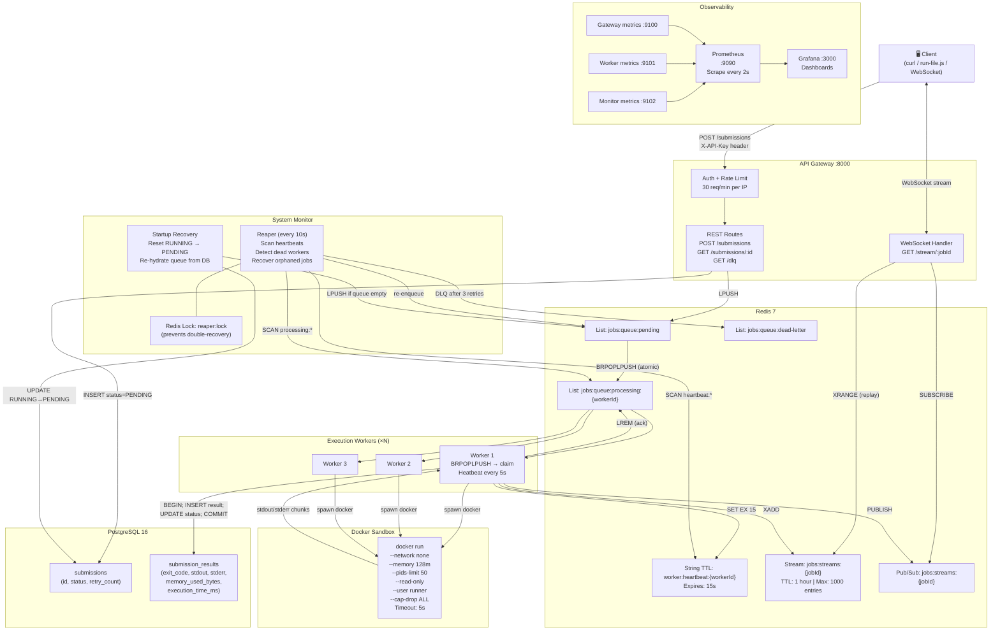
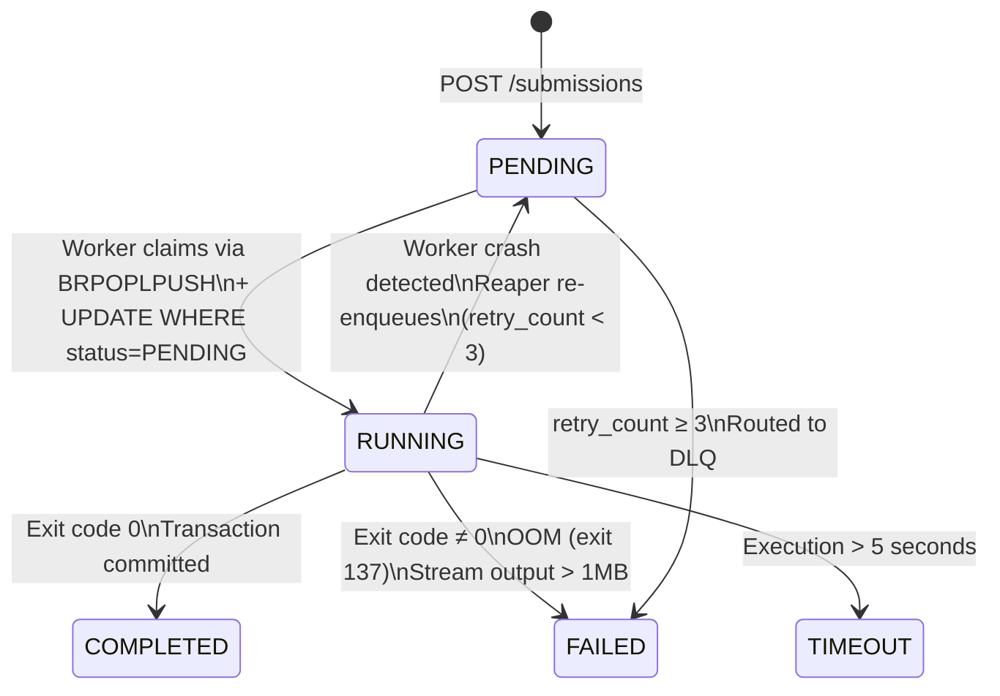

# Architecture Diagram

## System Overview



---

## Job Lifecycle State Machine



---

## Redis Key Namespace

```
jobs:queue:pending                    ← all unassigned jobs (List)
jobs:queue:processing:{workerId}      ← jobs owned by a specific worker (List)
jobs:queue:dead-letter                ← exhausted-retry jobs (List)
worker:heartbeat:{workerId}           ← liveness signal, TTL=15s (String)
jobs:streams:{jobId}                  ← replayable output chunks, TTL=1h (Stream)
reaper:lock                           ← distributed scan lock, TTL=15s (String)
```

---

## Sequence: Submit → Execute → Stream

```mermaid
sequenceDiagram
    participant C as Client
    participant API as API Gateway
    participant R as Redis
    participant W as Worker
    participant D as Docker
    participant DB as PostgreSQL

    C->>API: POST /submissions {code, language}
    API->>DB: INSERT submissions (status=PENDING)
    API->>R: LPUSH jobs:queue:pending
    API-->>C: 201 {jobId, status: PENDING}

    C->>API: WS /stream/{jobId}
    API->>R: XRANGE jobs:streams:{jobId} (replay existing)
    API-->>C: [previous chunks if any]
    API->>R: SUBSCRIBE jobs:streams:{jobId}

    W->>R: BRPOPLPUSH pending → processing:{workerId}
    W->>DB: UPDATE status=RUNNING WHERE status=PENDING
    W->>D: docker run (code via stdin)

    loop stdout/stderr chunks
        D-->>W: chunk
        W->>R: XADD jobs:streams:{jobId}
        W->>R: PUBLISH jobs:streams:{jobId}
        R-->>API: (subscriber receives)
        API-->>C: chunk via WebSocket
    end

    D-->>W: exit
    W->>DB: BEGIN; INSERT result; UPDATE status=COMPLETED; COMMIT
    W->>R: LREM processing:{workerId}
    W->>R: PUBLISH EXECUTION_COMPLETE
    R-->>API: EXECUTION_COMPLETE
    API-->>C: close WebSocket
```
